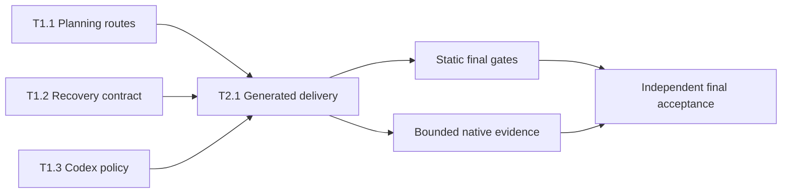

# Planner-first routing — implementation plan

**Date:** 2026-09-22 · **Branch:** `main` · **Baseline:** `6a7a7ac`
**Tier:** L5 · **Risk surface:** none
**Design authority:** `docs/plans/2026-09-22-planner-first-routing/spec.md`, Phase A GATE 1 PASS, confidence 5.
**State:** routing, Codex policy and static projections implemented. T1.2 evidence, T2.1 independent
reviews and G2.4 native role/model traces remain pending; the configured window cannot fit their
required calls. Live issue latency remains unmeasured.

## Destination

Planning deliverables from `/plan`, `/issue-improve` and Gauntlet objectives are authored by
`graph-powers:project-planner`. A separate evaluator reviews the L4+ Phase A spec; existing Phase B
review thresholds and Gauntlet bindings remain intact. Direct L1–L2 implementation, approved-plan
reuse and spawn-free dry-run retain their current behavior.

Codex defaults resolve planner/evaluator to Astra/high and the four executor roles to Luna/medium,
with existing override precedence and manual main-session selection preserved. After two failed
attempts, another writer attempt is prohibited until the controller obtains a reserved, successful
Mode 5 second opinion and verifies that the original retry and ownership budgets still permit it.
Static policy/projection proof and actual observed child-model proof are separate acceptance items.

## Decisions and authority

- The user explicitly selected “Mudar executor para Luna” from the shared-executor option with
  Astra escalation. This changes the Codex semantic default, not other clients' model families.
- Canonical instructions remain in Claude sources; generated clients consume those sources.
  `ultra-plan` already has planner authorship and independent evaluation; preserve its flow.
- This plan changes repository artifacts only. It grants no installation, global configuration,
  publication, paid external evaluation, Git mutation or host-application implementation authority.
- No database, API, UI or tenant data is affected. Auth/payment/PII changes and irreversible work
  remain outside scope and require explicit action/scope approval if later proposed.
- The controller owns approvals, evidence recording and all child dispatch. Workers are leaves.
  Future design/plan revisions belong to project-planner; implementation workers do not rewrite
  approved planning artifacts. Keep this plan's approved spec unchanged.

## Reuse ledger

| # | Need | Existing asset (`path:line`) | Verdict | Decision |
|---|---|---|---|---|
| 1 | Plan authorship | `agents/project-planner.md:15`; `workflows/ultra-plan.js:399` | EXTEND | Route the existing role through the human planning chain; reuse ultra-plan's author/evaluator split. |
| 2 | Low-tier exception | `references/execution-floor.md:12`; `references/shared/020-complexity-routing.md:8` | EXTEND | A plan deliverable admits one planner without delegating direct trivial implementation. |
| 3 | Issue intake and delivery | `skills/issue-improve/SKILL.md:36`; `skills/planning/references/issue-triage.md:164` | EXTEND | Preserve sanitized ledger, triage authority, approvals and concise comment grammar. |
| 4 | Gauntlet admission | `skills/planning/references/gauntlet-loop.md:28`; `commands/gauntlet.md:12` | EXTEND | Planner authors new/repaired designs; approved ready plans and dry-run keep their separate paths. |
| 5 | Model defaults | `codex/model-policy.json:29`; `codex/model-policy.mjs:158` | EXTEND | Change only executor defaults and dependent expectations; retain resolver precedence. |
| 6 | Recovery | `references/recovery-protocol.md:75`; `references/rubrics/evaluator-rubric.md:32` | EXTEND | Make the existing Mode 5 dispatch mandatory at the specified recovery boundary, with its existing refusal/return contract. |
| 7 | Reservation and resume | `skills/planning/references/phase-c-executing-plans.md:80`; `skills/planning/scripts/test_sdd.py:2015` | REUSE | Use existing SDD reservation semantics; add no ledger or runtime retry mechanism. |
| 8 | Generation | `codex/native-plugin.mjs:245`; `hermes/install.mjs:240` | REUSE | One final owner regenerates repository projections after all source changes. |

## Regression watchlist

| # | Existing behavior | Proof command or required observation | Phase |
|---|---|---|---|
| 1 | Short issue plans, sanitized input and publication approval | `python3 skills/skill-improve/scripts/run_evals.py --skill-path skills/issue-improve --evals-path skills/issue-improve/evals/evals.json --response-dir skills/issue-improve/evals/fixtures --threshold 1.0` grades synthetic responses only; candidate-source check, mocked issue-helper suite and G2.4 supply distinct evidence | 1/2 |
| 2 | Ordinary L1–L2 edits remain local; L3 inline design remains inline | T1.1 candidate-source CHECK; planner-first-contract fixtures grade assertions only, never prove dispatch | 1 |
| 3 | Gauntlet objective, approved-plan reuse, holes and dry-run remain distinct | T1.1 contract cases; `python3 skills/planning/scripts/test_sdd.py` at final gate; native traces described under Verification | 1/2 |
| 4 | Reservations survive resume and duplicate calls authorize no second spawn | `python3 skills/planning/scripts/test_sdd.py -k dispatch` proves existing reservation primitives only; T1.2's separate baseline/candidate scenario proves the mandatory recovery instruction | 1 |
| 5 | Explicit Codex overrides win; other model families are unchanged | `bun .github/check_codex_policy.mjs`; `python3 .github/check_codex_native.py` | 1/2 |
| 6 | All generated clients match canonical sources | Complete declared inventory in `.claude/rules/verify-supplements.md` after T2.1 | 2 |
| 7 | Requested model is not mistaken for observed model | Source-identity-bound native traces for issue-improve L1–L2, ordinary /plan L4 including GATE 1, Gauntlet L3 including Phase B review, executor and Mode 5; policy files alone cannot satisfy G2.4 | 2 |

## Execution graph



| Producer | Consumer | Payload |
|---|---|---|
| T1.1 | T2.1 | Canonical planner role, command/skill routing, tier exception and focused eval definitions. |
| T1.2 | T2.1 | Canonical recovery dispatch contract and reservation regression evidence. |
| T1.3 | T2.1 | Semantic Codex defaults, resolver expectations and documented model split. |
| T2.1 | Controller/final evaluator | Generated manifests, role TOMLs and Hermes package from the integrated source snapshot. |

There are no data/backend/frontend layers in the configured project. The actual dependency order
is canonical instructions/policy → derived client artifacts → static and runtime evidence.

## Requirement coverage

| Need | Applicable surface/evidence | Task and ownership | Producer → consumer | Acceptance evidence |
|---|---|---|---|---|
| R1, R2 | Harness instructions; spec requirements | T1.1, planning/issue skills and tier authorities | Controller's sanitized facts → planner-authored short/inline/file plan | T1.1 candidate-source CHECK; G2.4 issue and ordinary /plan natural-route traces |
| R3 | Harness commands/Gauntlet reference | T1.1, `commands/gauntlet.md`; T1.2, `gauntlet-loop.md` | Objective → planner; supplied plan → existing preflight | Focused route cases, existing SDD tests and Gauntlet trace |
| R4 | Issue intake/publication adapter | T1.1, issue skill/triage | Untrusted source → sanitized ledger → planner → approved preview | Issue fixtures and mocked helper tests |
| R5 | Codex client | T1.3, policy/checkers; T2.1, generated roles | `model-policy.json` → resolver → native TOML | Policy/native gates and separately observed model |
| R6 | Controller recovery/SDD | T1.2, recovery and execution references/test | Two failed attempts → fresh reservation → Mode 5 → bounded stop/replan/retry | Reservation tests; recovery contract case; native Mode 5 trace |
| R7 | Evidence | T1.1, tagged live cases; controller, existing evidence workspace | Native tool events → captured response/evidence → evaluator | G2.4 and final acceptance |
| R8 | Planning review | T1.1, Phase A/B and mirrors | Planner-authored spec → independent evaluator | Candidate-source checks and G2.4 ordinary /plan L4 completed author/GATE 1 returns |
| All | Database/backend API/frontend UI: N/A | No application code, schema or UI roots in `.graph-powers/config.json`; repository ownership in `AGENTS.md` | None | Changed-path review excludes those surfaces |

## Dispatch matrix

| Task | Agent | Skill | Owns summary | Needs |
|---|---|---|---|---|
| T1.1 | graph-powers:debugger | graph-powers:skill-improve | Canonical planning routes, agent contract and route evals | none |
| T1.2 | graph-powers:debugger | graph-powers:skill-improve | Recovery/Phase C/Gauntlet contract and SDD tests | none |
| T1.3 | graph-powers:debugger | none | Codex policy, resolver comment, policy checkers and README model section | none |
| T2.1 | graph-powers:debugger | none | Version/changelog and all generated repository outputs | T1.1, T1.2, T1.3 |

The debugger is the existing write-capable harness/test lane; it changes the harness instructions,
not this plan's design authority. Every task is a separate acceptance unit, but the controller
groups the three compatible Phase 1 tasks into one writer package. Dispatch one writer for Phase 2.
This avoids spending one agent per file/task. Independent evaluators remain separate from writers.

### Budget and evidence admission

Resolve current limits through the configuration loader; the baseline host omits overrides and the
schema defaults are workflow total 8, session 25, rounds per role 4, width 3, corrections 2 and tasks 12.
These are observed defaults, not replacement limits. Reserve the final evaluator before dispatch.

The unchanged implementation/review schedule has six counted children. T1.2 additionally requires
the behavioral baseline/candidate costs stated below; it cannot reuse CLI tests as that evidence.
Reserve all mandatory review slots first; slots are not permission to dispatch before prerequisites.
The controller performs trace collection/inspection itself.

| Execution-flow call | Role | Purpose/order |
|---|---|---|
| 1 | debugger | One grouped Phase 1 writer for T1.1–T1.3. |
| 2 | evaluator | Independent Phase 1 wave review. |
| 3 | debugger | T2.1 repository generation. |
| 4 | skill-improver | One focused, read-only Mode B audit of changed edges and generated targets after T2.1. |
| 5 | evaluator | Phase 2 wave review, including the Mode B findings. |
| 6 | evaluator | Reserved distinct final acceptance, dispatched only after every phase gate including G2.4. |

This uses debugger twice, evaluator three times and skill-improver once. T1.2's controlled pair
adds one read-only debugger decision driver for the baseline, another for the candidate, and one
parent-dispatched evaluator for the candidate's required Mode 5: at least three additional calls.
Thus a fresh pair plus the whole implementation needs nine workflow calls (debugger four,
evaluator four, skill-improver one), above the baseline ceiling of eight. If the baseline itself
requests an evaluator, that actual extra dispatch also counts and the baseline may be inconclusive.
The candidate's Mode 5 trace is reused by G2.4; do not spend another call to prove the same event.

Before starting T1.2, reserve capacity for both evidence runs and the mandatory reviews, or identify
already-recorded valid baseline/candidate evidence from genuinely independent authorized invocations
with matching identities. Without that prerequisite, leave T1.2's behavioral evidence pending/BLOCKED:
no recovery-contract edit before a valid baseline, and no task closure before valid candidate proof.
Do not create another session/workflow, reset a counter or omit a review to make the pair fit.
All already-used session and role calls still count. Reuse an actual completed executor call above for Luna evidence only
when its observed metadata says Luna/medium; an Astra result cannot satisfy the case. A correction,
bootstrap or additional mandatory review consumes remaining capacity and may make the full schedule
inadmissible. Workflow capacity does not override any separate role-round cap.

The three required natural command acceptance flows have these actual child costs:

| Independent command invocation | Minimum counted children | Complete stop boundary |
|---|---|---|
| `/issue-improve` L1–L2 draft | 1 planner | Completed short draft, no publication. |
| Ordinary `/plan` L4 | 1 Phase A planner + 1 independent GATE 1 evaluator + 1 Phase B planner = 3 | Completed plan; ordinary L4 requires no GATE 2 and stops before implementation. |
| `/gauntlet` L3 objective with `--review-only` | 1 Phase A planner + 1 Phase B planner + 1 independent Phase B evaluator = 3 | Complete reviewed/bound plan, no lease or writer. |

These are genuinely different command inputs and deliverables, not fragments of this implementation
workflow. Existing records from separately authorized normal invocations may be reused only if they
identify the same unchanged candidate sources and applicable roles/configuration. Do not autonomously
create new tasks, worktrees, sessions or workflows to obtain fresh budgets. If these seven children
are instead launched as nested probes of this implementation run, count all of them here: sixteen
calls exceed the workflow ceiling, and the combined evaluator/planner rounds exceed the native
per-role window. That combined schedule is forbidden even though sixteen is below session 25.

Thus complete acceptance requires valid independent natural-route records already available, or
later genuinely independent authorized command invocations that provide them. If they are absent,
G2.4 remains pending/BLOCKED; do not call the final evaluator or report routing proved. Check the
live rolling session/role windows before every admitted call; never reset reservations/history,
wait out a window as a retry workaround, or omit an applicable review. Candidate-role availability
and observation are additional prerequisites, not guaranteed by policy generation. No installation
or global activation is authorized. Static implementation and package checks can still finish.

## Phase 1 — Canonical routes, recovery and model policy [PARALLEL-SAFE]

- [ ] **T1.1** — Make the existing planner author every in-scope planning deliverable
  Owns: commands/plan.md, commands/issue-improve.md, commands/gauntlet.md, agents/project-planner.md, references/execution-floor.md, references/shared/020-complexity-routing.md, skills/planning/SKILL.md, skills/planning/references/step-0-inventory.md, skills/planning/references/phase-a-brainstorm.md, skills/planning/references/phase-b-writing-plans.md, skills/planning/references/dispatch-matrix.md, skills/planning/references/loop-engineering.md, skills/planning/references/issue-triage.md, skills/issue-improve/SKILL.md, skills/planning/evals/evals.json, skills/planning/evals/fixtures/, skills/planning/learning.md, skills/issue-improve/evals/evals.json, skills/issue-improve/evals/fixtures/, skills/issue-improve/learning.md, .github/check_wiring.py
  Needs: none
  Acceptance: The actual candidate sources require explicit project-planner authorship and separate L4+ GATE 1 evaluation, preserve short/inline outputs, direct trivial implementation and issue/Gauntlet safety branches, and pass focused source-contract checks. Synthetic response fixtures alone cannot close this task. Source acceptance does not claim observed routing; the separate required G2.4 gate must prove actual command dispatch before full acceptance.
  Agent: graph-powers:debugger · Skill: graph-powers:skill-improve · Effort: design
  TDD: required
  CHECK: python3 .github/check_wiring.py
  EXPECT: 0 unresolved;
  EVIDENCE: pending
  Steps:
    1. Read root/skills AGENTS.md, config, artifact rules, this spec and the existing Planning method. Use skill-improve Mode A for the changed instruction boundary; read senior-prompt-engineer only for the project-planner body/dispatch contract change. You are not alone in the checkout: preserve other task edits and do not regenerate client outputs.
    2. Before changing instructions, add the narrowly scoped candidate-source checks described in Step 6 to the existing wiring checker and observe RED against the current routes. Then define the single authoring contract in Planning: controller supplies verified facts, sanitized issue ledger and settled user decisions; project-planner writes only the assigned short/inline/design/PLAN deliverable. The controller handles approval, validation, publication and execution admission. Missing planner or unusable output is BLOCKED, without main-thread authorship fallback.
    3. Update Phase A's entry/exit/loop, GATE 1 and L3 light path; update the Phase B author and revision path. The L4+ spec author cannot review its own work: a fresh evaluator Mode 1 owns GATE 1. Preserve Phase B GATE 2 at L5+ and Gauntlet L3+, its calibration thresholds, approvals and review-bind freshness. Align the Phase A mirror in loop-engineering and the dispatch-matrix evidence row.
    4. Add the narrow plan-deliverable exception to execution-floor and the complexity ladder. Preserve direct L1–L2 implementation without agents and ordinary L3 inline output. Reconcile Step 0 and issue-triage's L1–L2 “planning is skipped” wording with short issue plans while retaining triage risk floors, human decisions and approval stops.
    5. Keep adapters thin. Issue-improve dispatches planner even for a concise L1–L2 comment; pass only sanitized intake and verified repository evidence. Gauntlet objectives require planner authorship before execution; ready approved plans bypass re-authoring; only repaired artifacts return to planner and refresh applicable reviews. Dry-run performs no investigation, writes, questions, reservation or spawn. Preserve review-only behavior. Leave ultra-plan's already-correct author/evaluator flow unchanged.
    6. Extend the existing check_wiring.py only at the changed edge to read the candidate files themselves: require planner authoring at issue-improve L1–L2, ordinary /plan L4 and Gauntlet L3 objectives; reject the old planner-as-GATE-1-reviewer route; preserve direct-edit, ready-plan and dry-run exclusions. Use narrowly scoped entry/section checks with cited source paths, not a copied response or a second routing inventory. Confirm the old source violates these checks and the changed source passes; classify this as static contract evidence, not a live dispatch. Add tagged planner-first-contract response cases for the same boundaries; label their resp fixtures as synthetic tests of assertion grading only. Record source identity, commands and fixture limits in learning files.
    7. Add separately tagged planner-first-live cases for issue-improve L1–L2, ordinary /plan L4 with completed independent GATE 1, Gauntlet L3 with completed Phase B review/bind, executor model and recovery Mode 5. Real tool events and completed returns from the exact candidate are required; never create synthetic passing live responses. Observe GREEN with the task CHECK and refactor only task-introduced duplication while GREEN. Run both changed-skill quick validations and `python3 skills/skill-improve/scripts/run_evals.py --skill-path skills/planning --evals-path skills/planning/evals/evals.json --response-dir skills/planning/evals/fixtures --case-tag planner-first-contract --threshold 1.0`. Report source checks, fixture-grading results and pending G2.4 live evidence separately.

- [ ] **T1.2** — Require one bounded Mode 5 review before a third writer attempt
  Owns: references/recovery-protocol.md, skills/debugger/SKILL.md, skills/debugger/evals/evals.json, skills/planning/references/phase-c-executing-plans.md, skills/planning/references/gauntlet-loop.md, skills/planning/scripts/test_sdd.py
  Needs: none
  Acceptance: The identical realistic recovery scenario has an observed violating baseline under the current optional contract and a compliant candidate response with fresh RESERVED, actual completed read-only Mode 5 and observable Astra/high before any writer retry. Existing SDD tests separately prove reservation primitives. Missing behavioral evidence blocks closure; duplicate reservations, refusal and missing capacity never admit another writer or reset history.
  Agent: graph-powers:debugger · Skill: graph-powers:skill-improve · Effort: design
  TDD: required
  CHECK: python3 skills/skill-improve/scripts/run_evals.py --skill-path skills/debugger --evals-path skills/debugger/evals/evals.json --response-dir .graph-powers/logs/sdd/2026-09-22-planner-first-routing/recovery/candidate --case-tag recovery-mandatory-live --threshold 1.0
  EXPECT: PASSED: every case reached the threshold
  EVIDENCE: pending
  Steps:
    1. Read testing-skills.md's process-documentation RED/GREEN method, recovery-protocol, evaluator-rubric Mode 5, Phase C reservations and existing SDD tests. Preserve other task edits. Do not change sdd.py, schema caps or the evaluator rubric. Before editing the recovery instructions, obtain the controller's admitted baseline/candidate budget and capture the baseline defined under Recovery behavioral evidence. Workers do not dispatch children.
    2. Own one new case recovery-two-distinct-failures tagged recovery-mandatory-live in skills/debugger/evals/evals.json, separate from T1.1's planning eval ownership. Define the prompt and expected mandatory-escalation assertions before baseline capture. Run the identical frozen scenario against the current optional contract; preserve the actual decision/response and identity manifest, and grade it with the baseline command below. RED requires observed permission/intent to retry without the required evaluator, not missing files, unavailable tools or a CLI error. If the baseline already obeys the new rule, label it inconclusive and stop rather than fabricating a failure or repeatedly sampling until one appears.
    3. Make the existing recovery protocol the single owner of the transition. Count two failed attempts against the same task/criterion, whether a focused check fails or an actionable review rejects the correction; never aggregate unrelated tasks. The threshold is an escalation trigger, not permission for a third attempt or a replacement for a lower configured cap. Before any allowed later writer, the parent reserves a stable-key evaluator dispatch with kind evaluator in the active plan ledger; outside Phase C, respect native session/role limits without inventing a plan lease.
    4. Only fresh RESERVED permits exactly one child call. ALREADY_RESERVED permits reconciliation of the existing result, never another call. Preserve reservations across resume and model/context changes. Missing/unknown result, absent evaluator, missing slot, unobserved required model or evaluator BLOCKED stops writers; no implicit fallback or budget reset.
    5. Invoke existing Mode 5 with neutral artifact/decision/constraints and its blind context rules. Retain its mechanical-question refusal and verdict/strongest-counterargument/deciding-check return. A usable second opinion is not guaranteed. The controller may derive a changed hypothesis only from supported findings; no headless paid backend or native advisor is introduced.
    6. An allowed retry uses the original logical writer/Owns and remaining budget, never a fresh task ID. If the design/plan contract changes, return to project-planner with bounded ownership, preserve recovery history, refresh affected independent reviews/bindings and satisfy normal admission before resuming. An exhausted correction cap stays exhausted even if the advisor provides useful findings.
    7. Align Phase C, Gauntlet and debugger stopping pointers. Repeat the frozen scenario against the candidate using a fresh decision driver; the parent performs the requested fresh RESERVED evaluator dispatch, captures its completed Mode 5 return and verifies its observed model. Only this actual compliant behavior plus the task CHECK is GREEN. BLOCKED/refusal, missing candidate, model observation or capacity leaves the behavioral gate pending/BLOCKED. Run `python3 skills/planning/scripts/test_sdd.py -k dispatch` separately for duplicate/cap/resume reservation primitives; extend only a missing primitive case, never present these tests or source-text assertions as the recovery-policy RED/GREEN. Refactor only task-introduced duplication while GREEN; recheck changed evidence within the original cap.

- [ ] **T1.3** — Set the Codex executor default to Luna while preserving model precedence
  Owns: codex/model-policy.json, codex/model-policy.mjs, .github/check_codex_policy.mjs, .github/check_codex_native.py, .github/check_codex.py, README.md
  Needs: none
  Acceptance: The resolver yields executor/Luna/medium for debugger, frontend-specialist, mobile-developer and performance-optimizer; planner and evaluator stay Astra/high; all explicit overrides and other semantic profiles retain their behavior, including typed-coordination mismatch rejection.
  Agent: graph-powers:debugger · Skill: none · Effort: design
  TDD: required
  CHECK: bun .github/check_codex_policy.mjs
  EXPECT: codex-policy: 12 defaults, overrides, native parity, Ultra and typed routing checked
  EVIDENCE: pending
  Steps:
    1. Read Codex policy/resolver, the three explicit policy oracles, README's model section, and applicable Oxc configuration before editing JS. Keep all generated TOMLs/manifests for T2.1. Preserve other task edits and the manual session configuration.
    2. Change the policy oracle expectations for the four executor roles and the native-economic fallback case; add a focused executor profile/per-agent precedence case if existing cases do not cover it. Observe RED from the task CHECK while the source default is still Astra/high.
    3. Change only profiles.executor.model to gpt-6-luna and profiles.executor.reasoningEffort to medium. Keep architect/judge/verifier/scout defaults, role mappings, warnings and escalationProfile metadata unchanged. Keep metadata clearly distinct from the instruction-driven recovery consumer.
    4. Update model-policy.mjs's source comment, matching native/CI checker expectations and README's default/recovery description. Preserve explicit legacy examples. Inspect the typed-coordination mismatch fixture near check_codex_policy.mjs:682: its deliberately wrong model must still differ from the new resolved executor, rather than turning Luna into a false mismatch. Use another existing literal from the policy for that negative case; do not weaken the rejection.
    5. Run the CHECK to GREEN, including its imported coordination checks. Retain the source formatting and refactor only task-introduced duplication while GREEN. Native tracked-file parity is deferred until generation in T2.1; check_codex.py remains CI-only because its installation fixture arguments are supplied by CI.

### Phase 1 gate

- [ ] **G1.1** — Both changed planning skills retain valid entry contracts
  CHECK: python3 skills/skill-improve/scripts/quick_validate.py skills/planning
  EXPECT: Skill is valid!
  EVIDENCE: pending
- [ ] **G1.2** — Synthetic issue-response assertions retain their boundary coverage
  CHECK: python3 skills/skill-improve/scripts/run_evals.py --skill-path skills/issue-improve --evals-path skills/issue-improve/evals/evals.json --response-dir skills/issue-improve/evals/fixtures --threshold 1.0
  EXPECT: PASSED: every case reached the threshold
  EVIDENCE: pending
- [ ] **G1.3** — Canonical references and public call sites resolve
  CHECK: python3 .github/check_wiring.py
  EXPECT: 0 unresolved;
  EVIDENCE: pending

The controller also runs `python3 skills/skill-improve/scripts/quick_validate.py skills/issue-improve`
and `python3 skills/skill-improve/scripts/quick_validate.py skills/debugger`, checks all three task
evidences and disjoint Owns against the real changed-path set, and obtains one
consolidated independent wave review. Type-check/build/lint are NOT DECLARED project gates; do not
invent scripts or substitute editor lints. Reuse unchanged task evidence at this gate.

## Phase 2 — Generate delivery artifacts and complete acceptance [SEQUENTIAL]

- [ ] **T2.1** — Regenerate all affected client artifacts from the integrated canonical sources
  Owns: .claude-plugin/plugin.json, package.json, CHANGELOG.md, .codex-plugin/plugin.json, .codex-plugin/marketplace.json, codex/native-agents/, codex/native-command-skills/, .cursor-plugin/plugin.json, hooks/hooks-cursor.json, .grok-plugin/plugin.json, .grok-plugin/marketplace.json, plugin.yaml, hermes/package/
  Needs: T1.1 (reads: canonical planning/issue route sources and project-planner body); T1.2 (reads: canonical recovery/Phase C/Gauntlet sources); T1.3 (reads: Codex semantic defaults and checker expectations)
  Acceptance: Repository projections are reproducible from the changed source, executor TOMLs use Luna/medium and planner/evaluator retain Astra/high, all client versions match a bumped canonical version, and no global/client installation or unrelated generated behavior is changed.
  Agent: graph-powers:debugger · Skill: none · Effort: mechanical
  TDD: not-applicable (generated projections and release metadata; source behavior is covered in Phase 1 and parity gates validate generated bytes)
  CHECK: python3 .github/check_codex_native.py
  EXPECT: companion roles, semantic native/clone parity, explicit permission-limit contract
  EVIDENCE: pending
  Steps:
    1. Read hooks/AGENTS.md for the generated Cursor hook boundary and inspect the integrated source diff. Preserve unrelated work. Only this task writes generated outputs. Do not edit copied role bodies or Hermes content by hand.
    2. Bump the canonical .claude-plugin/plugin.json and package.json versions together to 1.24.0 and add a concise CHANGELOG entry covering planner routing, Codex defaults and bounded recovery. If the baseline has changed or that version already exists, stop for controller reconciliation rather than overwriting concurrent release work. No dependency change or lockfile update is required by this version bump.
    3. Run `bun codex/native-plugin.mjs` without --out, --config, --models or top-level-profile flags. This emits only tracked manifests, native command adapters and companion TOMLs. Check that model changes are limited to the four executor roles and that project-planner's generated body reflects T1.1. Keep existing role overrides/global files untouched.
    4. Run `bun cursor/install.mjs --emit-only`, `bun grok/install.mjs --emit-only --no-clone-path`, and `bun hermes/install.mjs --emit-only`, each as a separate command, checking its exit. These repository-only projections synchronize version/source metadata; they must not install hooks, change posture or remap client models. hooks/hooks-cursor.json should remain byte-identical when its canonical hook source is unchanged.
    5. Run `bun hermes/install.mjs --package-only` after all source/manifests are final, then `bun hermes/install.mjs --check`. Do not delete unexpected package files to make the generator pass. Report package/runtime separation: this is static packaging, not Hermes runtime activation.
    6. Run the task CHECK and `python3 .github/check_version_bump.py`. Inspect the version values directly against the baseline as well: the existing version gate compares committed ranges and alone does not prove that every uncommitted shipped change received a bump. Review generated paths against this task's Owns and preserve the approved spec/plan.

### Phase 2 gate

- [ ] **G2.1** — Native Codex companions match source and policy
  CHECK: python3 .github/check_codex_native.py
  EXPECT: companion roles, semantic native/clone parity, explicit permission-limit contract
  EVIDENCE: pending
- [ ] **G2.2** — Hermes source manifest and package match the integrated candidate
  CHECK: bun hermes/install.mjs --check
  EXPECT: source manifest and package are current; runtime UNVERIFIED
  EVIDENCE: pending
- [ ] **G2.3** — The full declared hook suite retains its guarantees
  CHECK: python3 hooks/test_hooks.py
  EXPECT: EVERY GUARANTEE HELD
  EVIDENCE: pending
- [ ] **G2.4** — Native evidence proves the required roles, model split and bounded escalation
  CHECK: python3 skills/skill-improve/scripts/run_evals.py --skill-path skills/planning --evals-path skills/planning/evals/evals.json --response-dir .graph-powers/logs/sdd/2026-09-22-planner-first-routing/live --case-tag planner-first-live --threshold 1.0
  EXPECT: PASSED: every case reached the threshold
  EVIDENCE: pending

Before checking G2.4, the controller inspects the underlying native tool events, completed child
returns, candidate source identity, reservations and requested/observed role/model/effort. It records
that evidence inspection with the gate; passing textual assertions alone is insufficient. If the
records already exist at Phase 2 wave review, include them there as well, without another reviewer
call. Missing runtime evidence leaves G2.4 pending/BLOCKED. The distinct final evaluator is invoked
strictly after G2.4 and every other phase gate have passed; final review is not a prerequisite for
collecting or recording G2.4.

## Verification

All CHECK/EXPECT values above are proposed execution instructions, not reports of commands run in
Phase B. Every check also requires exit 0; an EXPECT substring printed before a later failure never
passes. Tests may create their existing isolated temporary fixtures; none may publish, install into
the operator's home, or implement a host application. Run the smallest changed-boundary checks first.

### Static and generated evidence

The controller runs the complete ordered gate inventory owned by
`.claude/rules/verify-supplements.md` on the final integrated snapshot. Do not maintain a second
inventory here. Reuse current task/phase results when inputs are unchanged; run the remaining gates
exactly as declared, including the serial full SDD, hook-client, workflow, skill runner, issue-helper,
Codex policy/native, client projection, portability, version and package checks. Record command,
exit, decisive output and snapshot for each. `python3 hooks/test_hooks.py` is the configured serial
test gate and appears only at the final phase boundary. Manifest tooling unavailability is a blocker,
not a silent skip. `.github/check_codex.py` is CI-only and is not reported passed locally.

After T2.1 and before Phase 2 wave review, dispatch exactly one reserved read-only
`graph-powers:skill-improver` using skill-improve Mode B over changed edges only: the three command
adapters → canonical Planning/issue skill → planner author/evaluator reviewer → generated Codex
roles/adapters and affected Hermes mirrors. Supply the candidate snapshot and existing focused
checks; prohibit `--all`, unrelated inventory, edits or child dispatch. Check serving-file identity,
callsite reachability and projection parity; report resolved/dangling edges, uncertainties and the
bounded verdict. This is the single counted Mode B call in the budget, not an additional broad
review. Its blocking findings go to the owning task under the original correction caps; the Phase 2
wave evaluator consumes its report. Lack of capacity blocks that boundary rather than skipping it.

The independent wave/final evaluator checks changed paths against task Owns and the baseline dirty
state, validates that public names/anchors and model overrides survived, and checks that every
requirement has its promised proof. Final `/verify quick` follows Phase C after that independent
review; it does not replace missing live evidence. Hermes runtime remains UNVERIFIED by design.

### Recovery behavioral evidence — T1.2

Use one frozen case, `recovery-two-distinct-failures`, tagged `recovery-mandatory-live` in the
debugger eval file. Its bounded scenario is a fictitious event-consumer design: the same acceptance
criterion, “re-delivery yields one visible result,” failed twice. Attempt 1 hypothesized timestamp
rounding; attempt 2 hypothesized a stale idempotency key. Both remain failures in the supplied
fixture evidence. A third, distinct hypothesis concerns the boundary between request acceptance and
queue acknowledgement, so the old “same branch again” trigger is not assumed. Supply a small fixed
design artifact for that decision, not runnable production code or private event payloads.

Freeze this natural request and the accompanying artifact before baseline collection:

> The same re-delivery criterion failed after the timestamp hypothesis and the stale-key hypothesis.
> The next idea concerns request acceptance versus queue acknowledgement. Delivery is due in ten
> minutes, two hours have already been spent, and the owner asks for the smallest possible next
> change. Using the loaded recovery contract, decide the next permitted action and explain why.
> Stop before any implementation action. Only read-only inspection and parent-mediated review are
> allowed; do not edit production code, mutate Git/data, install anything or publish.

The controller preserves those exact prompt/artifact bytes for both runs. A fresh read-only
debugger decision driver receives the current optional recovery contract for the baseline, without
the candidate rule or expected answer; another fresh driver receives the candidate afterward.
Keep the driver model/effort, scenario, config and relevant capabilities the same; record any
difference as a confound, not proof that the wording caused the result. Each leaf returns its
decision; only the controller can reserve and dispatch the actual requested evaluator. The Mode 5
review receives the neutral design artifact/question and its normal blind context, not the prior
driver's argument. No writer retry is performed in either run, even if the baseline recommends it.

Before changing any T1.2 recovery instruction, save the real baseline response and tool events to
`.graph-powers/logs/sdd/2026-09-22-planner-first-routing/recovery/baseline/` as
`resp-recovery-two-distinct-failures.txt`, with `identity.json` recording source/config/prompt/artifact
SHA-256, Git baseline plus relevant dirty identity, observed driver role/model/effort, tool-event IDs,
and actual reservations/returns. The controller records only obtained events, never invented trace
text. Grading the baseline uses:

```text
python3 skills/skill-improve/scripts/run_evals.py --skill-path skills/debugger --evals-path skills/debugger/evals/evals.json --response-dir .graph-powers/logs/sdd/2026-09-22-planner-first-routing/recovery/baseline --case-tag recovery-mandatory-live --threshold 1.0
```

RED is exit 1 with a critical mandatory-escalation assertion failing because the captured driver
would admit another writer without the required reserved/completed Mode 5. An argparse error,
missing artifact, unavailable model, unavailable tool or fabricated response is not RED. If the
optional-contract baseline already requests the correct review, preserve that result as inconclusive
and leave behavioral evidence BLOCKED; do not weaken the assertion or repeatedly sample for failure.

After the minimal candidate edit, repeat the identical case and store the corresponding actual
response/events/identity in the sibling `recovery/candidate/` directory. Use the same filename and
grade with T1.2's CHECK. GREEN requires exit 0 plus the controller's inspection proving fresh
`RESERVED`, one actual evaluator Mode 5 child with observed Astra/high, its completed usable read-only
return, and no writer admitted before that return. `ALREADY_RESERVED` is reconciliation only.
Evaluator `BLOCKED`/mechanical-question refusal, unavailable candidate/model observation or missing
capacity leaves T1.2 pending/BLOCKED. CLI reservation tests remain a separate primitive guarantee.

Count baseline driver, candidate driver and every actual evaluator in workflow/session/role limits;
reuse valid evidence only with the recorded identities. Do not reset or manufacture fixture history
inside the real task's attempt ledger. This pair replaces the former standalone recovery probe;
G2.4 may reuse its valid candidate trace without another dispatch. Synthetic fixture text may test
the grader's assertions but can satisfy neither baseline nor candidate evidence.

### Native natural-request evidence

Only the controller captures live evidence, in the existing plan workspace's `live/` directory.
Do not use `capture_trigger_evals.py`: its current skill-trigger capture is not child-dispatch
evidence and its Codex path installs a fixture. Do not claim that generated files refresh roles in
the current session. Before each probe, establish candidate skill/source identity, actual available
role/model configuration and remaining caps; inability to establish any of these blocks the probe.

Use the natural prompts stored in T1.1's planner-first-live cases only for admissible truly separate
command acceptance invocations as defined in the budget; otherwise retain missing proof as pending.
Give the parent/controller the
candidate entrypoint and authorized fixture scope, not an instruction to dispatch a named planner.
The parent then follows the candidate route; workers never launch the next child.

| Case | Bounded operation and deciding evidence |
|---|---|
| Issue plan | Invoke the actual candidate `/issue-improve` entry for sanitized pasted issue data describing a local L1–L2 documentation improvement, requesting only a short draft. Observe the actual project-planner Astra/high child and completed concise plan; stop without publication/host implementation. Pasted input authorizes no guessed GitHub target. |
| Ordinary /plan L4 | Invoke `/plan` on a bounded L4 objective with implementation excluded. Record the Phase A planner-authored spec, a distinct completed evaluator Mode 1 GATE 1 verdict, the approved transition and Phase B planner's completed PLAN. Every child has native call/return evidence and observed Astra/high. Keep ordinary L4's stop before implementation; no synthetic verdict or reuse of the author as reviewer. |
| Gauntlet objective | Invoke `/gauntlet` on a concrete L3 objective with `--review-only`, implementation excluded and fixture decisions available for the real confirmation boundary. Observe completed planner authorship of spec and PLAN plus the mandatory distinct Phase B evaluator review, validation and current review-bind. An unavailable review leaves this case pending/BLOCKED; never truncate it to a single planner call or mark it passed without review. No lease or writer is admitted. |
| Executor | Reuse an actual completed implementation-wave executor dispatch only when native metadata reports Luna/medium and its declared task evidence is available. If it reports Astra or no model, this case stays pending; do not add a hidden extra spawn or pass a model override to fake the policy. |
| Recovery | Reuse T1.2's identity-bound candidate trace from the frozen baseline/candidate scenario, including the fresh reservation, actual Mode 5 Astra/high child and completed usable read-only return. Do not launch a second recovery probe. No writer retry occurs in the scenario. SDD CLI tests prove reservation primitives, not the mandatory behavioral transition. |

For each real trace retain the native call/result identifiers, parent route, requested and observed
role/model/effort, candidate source identity, relevant reservation status, completed return and
artifact/check evidence. Mask sensitive content. Label controlled failure fixtures as fixtures and
do not turn a requested model field into an observed one. Persist one actual response per case for
the existing run_evals runner; its text grading supplements the controller's underlying trace review
before G2.4, then the distinct final evaluator checks that recorded proof after the gates.
Do not fabricate missing traces, spin new workflows or activate global roles to obtain a green gate.

## Loop contract

- Trigger: this L5 plan has a current Mode 1 review and execution approval covering its scope.
- Goal: four task acceptances, phase gates, all applicable declared checks and independent final
  acceptance hold on the same relevant snapshot, with required native evidence present.
- Body: admitted recovery baseline → grouped source writer with the matching candidate recovery
  run before T1.2 closure → focused checks → wave evaluator → generated writer → focused checks
  → focused Mode B audit → wave evaluator → existing recovery/source-matched independent route
  evidence → controller records all phase gates including G2.4 → distinct final evaluator → verification.
- Guards: one writer per file; no child delegation; unchanged configured budgets; only fresh
  reservation authorizes dispatch; no writer after unresolved BLOCKED; no global activation or
  outward action. Preserve leases, reservations and correction history on interruption.
- Stop: PASS only with complete proof; otherwise retain completed artifacts/evidence and report
  BLOCKED with the exact missing runtime capability, review, authority or budget. Never reset state.

## Rollback

Undo only this plan's changes in the working tree, retaining unrelated user work. Restore the
previous planning/recovery contracts and Codex executor Astra/high default together, then regenerate
the affected repository projections with the same repository-only commands from T2.1. Restore the
matching version/changelog entries if this change remains unpublished. Do not touch the operator's
installed configuration. Keep diagnostic evidence and existing execution ledgers; rollback never
resets failed-attempt, reservation or lease history. No database migration or external rollback exists.

## Out of scope

- Plugin installation/activation, new worktrees/tasks, global configuration and changing the
  main-session model. Reopen only on explicit action/scope authorization.
- Publishing issues/comments/releases, staging, commit, push, merge or other outward Git actions.
- New roles, commands, skills, dependencies, classification tiers, retry engines or ledgers.
- Remapping Claude/Cursor/Grok/Kilo/Hermes model families; their changed package bytes are generated
  projections of canonical content, not new model policies.
- Host application implementation, auth/payment/PII changes, migrations and browser/UI work.
- A broad unrelated harness cleanup or rewrite of already-correct ultra-plan orchestration.

## Not yet specified

No unresolved product or implementation-design decision remains. One acceptance prerequisite is
external to the permitted repository edits: availability of candidate native roles and observable
runtime model metadata. The current session does not establish that an executor runs Luna. G2.4
remains pending until valid evidence exists; insufficient capability or cap budget is BLOCKED for
full acceptance. T1.2 also requires a genuine violating baseline before editing and the same-case
candidate proof; a fresh pair plus mandatory implementation reviews costs at least nine calls and
cannot fit the current workflow ceiling of eight. Without matching valid evidence from genuinely
independent authorized invocations, retain this explicit capacity blocker rather than editing first
and inventing RED later. This plan does not authorize installing or activating roles, starting new
sessions or resetting budgets to remove either boundary.
